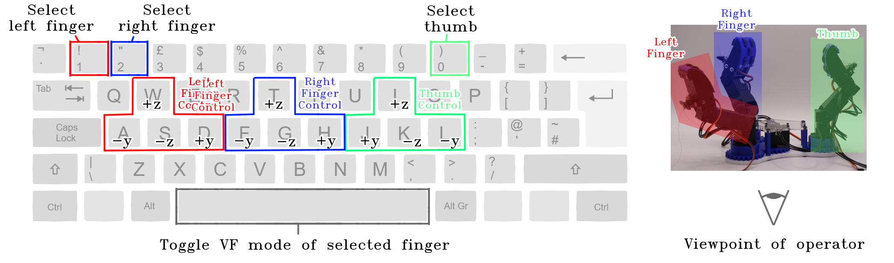

# VF3 Manipulator
The VF3 manipulator is a low-cost (<£300) 7 DoF gripper intended for dextrous manipulation tasks. It incorporates variable friction finger-tips to perform within-hand manipulation. Instructions on how to build a VF3 Manipulator can be found in the CAD directory. ROS2_PACKAGES contains the ros2 middleware written for this project, and FRICTION_CONTROL contains a Platform.io project implementing the friction change actuation via FreeRTOS firmware on a microcontroller. 

# Starting the VF3 Manipulator
Once constructed, the VF3 Manipulator may be teleoperated using the below control scheme:


The packages for this project have been tested in ROS2 Humble. Clone the ROS2_PACKAGES folder to your ROS2 workspace's ``src`` folder, and use ```colcon build```. Then, after doing ```source install/setup.bash```, ```ros2 launch vf3_manipulator_bringup demo.launch.py``` with the Dynamixel controller connected to the /dev/ttyUSB0 port and the ESP32 connected to the /dev/ttyUSB1 port. This should return the manipulator to its home position.